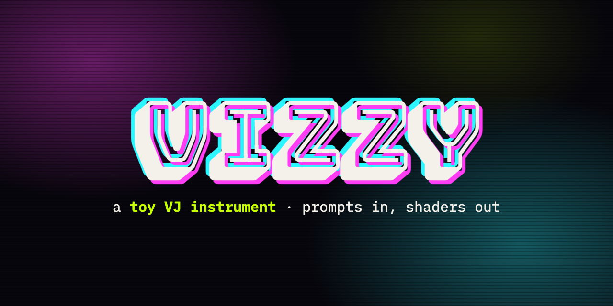

<p align="center">
  <a href="https://www.sinanguclu.co.uk/vizzy/"></a>
</p>

# Vizzy

A desktop VJ instrument: type a prompt, a local LLM designs the visual, a
native Rust/wgpu engine renders it. Two scenes × four decks, crossfaded,
audio-reactive, MIDI-controlled, with per-deck post filters and texture
sharing (Syphon on macOS, Spout on Windows) into other VJ software.

Decks can run LLM-designed **patches** (composed from a library of classic
visualizer building blocks — spectrum bars, tunnels, plasma, fractals,
matrix rain…), **images**, **3D models** (glTF/OBJ/STL, spinning or flown
over as landscapes) and **procedural fly-through scenes**. Everything you
make autosaves to a file-backed library and the app reopens exactly as you
left it.

**New to Vizzy?** The [getting-started guide](https://www.sinanguclu.co.uk/vizzy/getting-started.html)
walks through your first visual and switching on the sound. There's also a
quick in-app tour (the **?** in the top bar).

## Prerequisites

- Nothing, if you grab a packaged build from the
  [latest release](https://github.com/Driptap/vizzy/releases/latest)
- From source: Node.js 20+ and a [Rust toolchain](https://rustup.rs)
- [Ollama](https://ollama.com) for generation (Vizzy offers to install and
  manage it for you on first run)

## Installing Ollama

Vizzy generates visuals with a local LLM via Ollama — nothing leaves your
machine, no API keys needed. The easy way: open Vizzy and follow the setup
screen. By hand:

1. **Install** the runtime:
   - **macOS** — download from [ollama.com/download](https://ollama.com/download),
     or `brew install --cask ollama-app`
   - **Windows** — download and run the installer from
     [ollama.com/download](https://ollama.com/download)
   - **Linux** — `curl -fsSL https://ollama.com/install.sh | sh`
2. **Run it.** The macOS/Windows desktop app starts the server automatically;
   on Linux or with a CLI-only install, run `ollama serve`. Vizzy expects the
   default port, 11434 (or manages its own instance one port up).
3. **Pull a model.** The default is `qwen2.5-coder` (~4.7 GB):
   `ollama pull qwen2.5-coder` (or `npm run model:pull` from a source
   checkout). Generation asks the model for a small JSON spec under a
   constrained-decoding schema, so even small models produce working visuals —
   the model name is editable in Vizzy's top bar.

## Run

The app is a Tauri 2 shell: the React UI lives in the system webview, and
everything real-time is native Rust — the wgpu render engine, audio analysis,
MIDI input and the managed Ollama runtime.

```bash
npm install
npm run model:pull   # download the default Ollama model (qwen2.5-coder)
npm run dev          # vite dev server + tauri shell, hot reload
npm run dist         # native release bundle (dmg / nsis / AppImage + deb)
```

Rust tests run from `src-tauri/`: `cargo test` (plus
`cargo test -- --ignored` for the GPU suite on a machine with a GPU).

## Usage

1. **Audio** — pick an input device in the top bar and hit *Enable Audio*.
   Four bands (low/mid/high/level) are computed natively (cpal + FFT) and fed
   to every deck each frame.
2. **Generate** — type a prompt in a deck and hit *Generate*. The LLM picks a
   generator from the patch catalog, a palette, warps and audio routing;
   the engine composes it into a shader. Requests queue sequentially so decks
   don't fight over the LLM. *SCENE* mode generates a 3D fly-through instead.
3. **Mix** — four faders per scene feed the additive composite; the central
   crossfader blends scene A and B on the master output. Each deck has
   layers, FX (tilt/contrast/hue/sat), a **post filter** (invert, hue shift,
   posterize, pixelate, scanlines, edge, RGB split, kaleido, swirl, blur,
   luma key, ripple — many audio-reactive), per-control automation (AUT), and
   a beat-locked loop sequencer driven by the global BPM.
4. **Master Out** — opens the composite in its own window; double-click it
   for fullscreen on a projector. *Glow* adds a bloom pass on the master; the
   share toggle publishes it to Resolume/MadMapper/OBS over *Syphon* (macOS)
   or *Spout* (Windows).
5. **MIDI** — toggle *MIDI Learn*, click a fader, move a physical control:
   bound. Toggle Learn off to perform.
6. **Library** — saves patches, deck presets (a whole scene's 4 channels),
   images, 3D models and generated scenes. Drag files in, right-click entries
   to assign; per-deck *SAVE* captures the running visual with a screenshot.

## Architecture

- `src-tauri/src/render/engine.rs` — the wgpu render thread: 8 offscreen deck
  targets, the WGSL compositor (scene/preview/master passes), a persistent
  offscreen master target, the glow chain, JPEG monitor readbacks, and the
  master window blit. Self-driving: the render clock keeps running even when
  the UI webview is hidden.
- `src-tauri/src/render/patch.rs` — the patch composer. An LLM-emitted JSON
  spec (generator + params + palette + warps + audio routing + post) is
  assembled from hand-written, tested WGSL blocks: 27 generators, 11 warps,
  cosine palettes, and feedback trails via per-deck history textures.
  A spec that parses always renders — there is no generated shader code.
- `src-tauri/src/render/content.rs` / `content.wgsl` — sprite and lit mesh
  passes: glTF/OBJ/STL loading with base-color textures and mipmaps,
  sRGB-correct Blinn-Phong lighting, 4× MSAA, landscape/scene flight rigs.
- `src-tauri/src/render/evaluate.rs` — per-frame evaluation of loops,
  automation, and audio routing on the render thread's own clock.
- `src-tauri/src/render/filter.wgsl` — the per-deck post-filter pass: one
  pipeline whose `kind` selects the effect (invert, hue, posterize, pixelate,
  scanlines, edge, RGB split, kaleido, swirl, blur, luma key, ripple), run
  only when some deck has a filter selected; the order is shared with
  `params.rs` and the UI selector.
- `src-tauri/src/render/syphon.rs` — SyphonMetalServer via objc2 (macOS).
- `src-tauri/src/render/spout.rs` — native Spout 2 sender, no C++ SDK, via a
  CPU readback onto a shared D3D11 texture (Windows).
- `src-tauri/src/audio.rs` — cpal input + rustfft band analysis, shared
  in-process with the render thread.
- `src-tauri/src/midi.rs` — midir input stream; the CC learn/binding logic
  stays in `src/engine/MidiEngine.ts`.
- `src/engine/NativeRenderEngine.ts` — thin state mirror: knob changes are
  coalesced into one state push per frame; staging entry points; monitor
  frame painter.
- `src/lib/patches.ts` + `src/llm/patches.ts` — the patch catalog, the
  response validator, and the LLM contract (system prompt + JSON schema for
  Ollama structured outputs).
- `src/lib/sceneGenerator.ts` + `src/lib/expr.ts` — procedural scenes: a
  sandboxed math-expression compiler meshes LLM-emitted surface functions.

## Troubleshooting

- **"Ollama unreachable"** — check `ollama serve` is running on port 11434,
  or let Vizzy's setup screen manage its own instance.
- **macOS says the app "is damaged"** — builds are unsigned; run
  `xattr -dr com.apple.quarantine /Applications/Vizzy.app` once.
- **Black master output** — deck 1 starts at full opacity, others at 0;
  check the mixer faders and the crossfader position.
